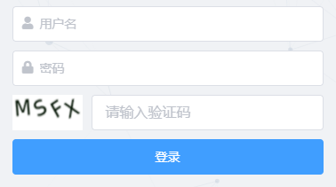

# django-simpleui-captcha

django-simpleui-captcha 是一个 django 后台管理登录验证码插件

## 界面


## 安装
```
pip install django-simpleui-captcha
```

### 依赖
- Django
- django-simple-captcha

## 快速开始
### 1. 添加 "simpleui_captcha" 到 INSTALLED_APPS 设置, 注意要放在最前面
```py
INSTALLED_APPS = [
    "simpleui_captcha",
    "simpleui",
    ... 
]
```

### 2. 添加 `simpleui_captcha` 的 `url` 到你的项目 `urls.py` ::
```py
path('simpleui_captcha/', include('simpleui_captcha.urls')),
```

### 3. 运行 `python manage.py migrate` 迁移验证码模型
